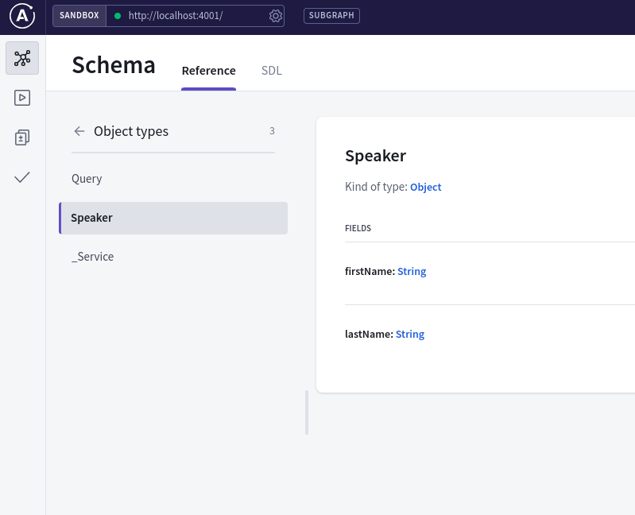
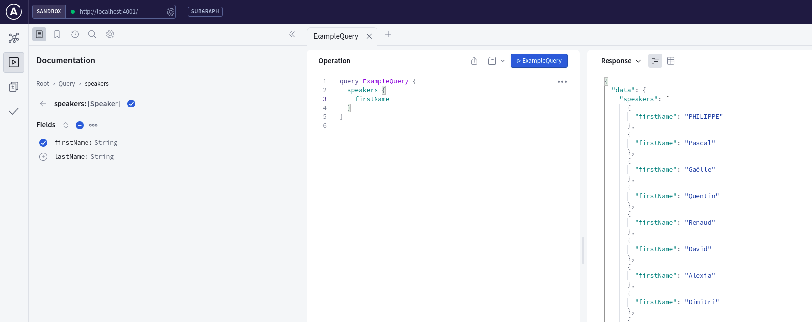
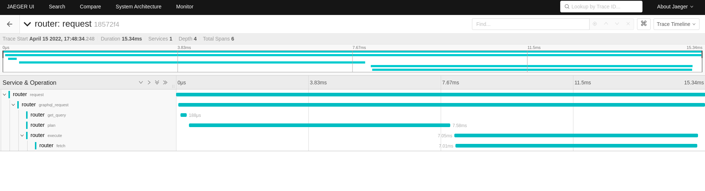
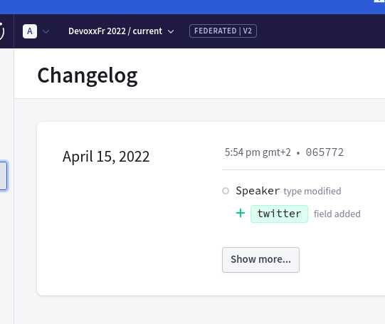
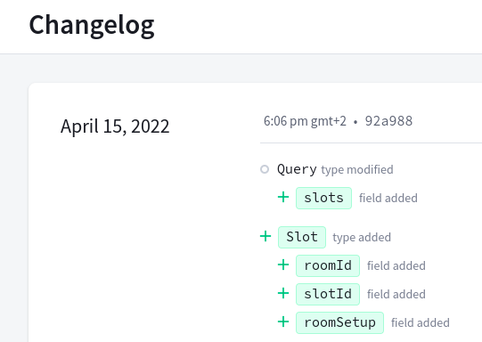
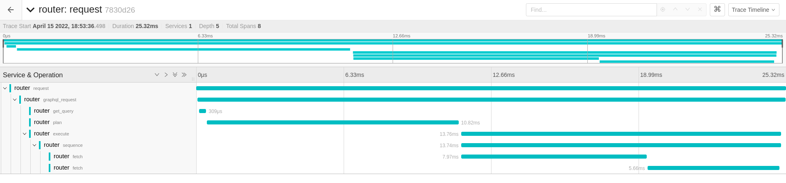

# Devoxx France 2022 University: GraphQL Federation

Through this tutorial, we will demonstrate how to build a federated graph using Apollo studio, rover and router,
by building upon the [Devoxx France 2022 CFP API](https://cfp.devoxx.fr/api).

## Prerequisites

- npm
- node < 18.0
- nodemon
- [Apollo Router](https://github.com/apollographql/router/releases)
- [rover](https://github.com/apollographql/rover#installation-methods)
- (optional) [Jaeger](https://www.jaegertracing.io/download/#binaries)


### (optional) create an account on https://studio.apollographql.com/

The demo can be done entirely in terminal if there are connectivity issues, but will be much nicer when using Apollo Studio.

## Step 1: creating our first subgraph

*git tag: step1*

- copy the `template/` directory to `speakers/`
- rename `TEMPLATE` to `speakers` in `package.json`, `index.js` and `opentelemetry.js`

We are creating a subgraph to expose data about the Devoxx speakers. It is available as JSON data in `speakers.json`.
`index.js` contains the boilerplate code to create a subgraph.
First, we load the JSON file in memory:

```javascript
let data = JSON.parse(fs.readFileSync('../TEMPLATE.json'));
```

`typeDefs` will contain the GraphQL schema.

`resolvers` is the concrete implementation for the GraphQL operation we expose.

`server` is the actual server, that combines the schema, resolver and the JSON data as a data source.

*For this demo, we use in memory data, while for an actual production implementation, we would use
a [datasource](https://www.apollographql.com/docs/apollo-server/data/data-sources/) connecting to a database
or another API, that can leverage a local cache*.

To launch the subgraph, we need to create a valid schema. Looking at `speakers.json`, we will create a `Speaker` type
with a few fields:

```graphql
type Speaker {
    firstName: String
    lastName: String
}
```

Put this definition in `typeDefs`:

```javascript
const typeDefs = gql`
type Speaker {
    firstName: String
    lastName: String
}
`
```

Start the subgraph (we use nodemon to get hot reload):

```
$ nodemon index.js 
[nodemon] 2.0.15
[nodemon] to restart at any time, enter `rs`
[nodemon] watching path(s): *.*
[nodemon] watching extensions: js,mjs,json
[nodemon] starting `node index.js`
Enabling inline tracing for this federated service. To disable, use ApolloServerPluginInlineTraceDisabled.
🚀 Subgraph speakers running at http://localhost:4001/
```

If you open `http://localhost:4001/`, you will get redirected to Apollo Explorer, through which you can explore
your schema and send queries:



As it is, the subgraph cannot do anything, so we will add an operation to get all the speakers:

```graphql
type Speaker {
    firstName: String
    lastName: String
}

type Query {
  speakers: [Speaker]
}
```

And we can write the resolver for this operation:

```javascript
const resolvers = {
    Query: {
        speakers: (parent, args, context, info) => {
            return data;
        }
    },
};
```

We can verify that it works with the following query:

```grapqhl
query ExampleQuery {
  speakers {
    firstName
  }
}
```



You can perform the same operation with curl as follows:

```
curl --request POST \
    --header 'content-type: application/json' \
    --url http://localhost:4001/ \
    --data '{"query":"query ExampleQuery {\n  speakers {\n    firstName\n  }\n}"}'
```

## Step 2: connect to the router

*git tag: step2*

We will now start using the router with our subgraph. Even with only one subgraph, it can be useful
as a high performance frontend to validte queries, balance the load between subgraph instances,
validate tokens, etc.

We need to create a supergraph schema from our subgraph schema. For this, we will use the rover cli:


rover will extract the subgraph schema through introspection with the command `rover subgraph introspect http://localhost:4001/ > speakers.graphql`:

```graphql
directive @key(fields: _FieldSet!, resolvable: Boolean = true) repeatable on OBJECT | INTERFACE

directive @requires(fields: _FieldSet!) on FIELD_DEFINITION

directive @provides(fields: _FieldSet!) on FIELD_DEFINITION

directive @extends on OBJECT | INTERFACE

directive @external(reason: String) on OBJECT | FIELD_DEFINITION

directive @tag(name: String!) repeatable on FIELD_DEFINITION | OBJECT | INTERFACE | UNION | ARGUMENT_DEFINITION | SCALAR | ENUM | ENUM_VALUE | INPUT_OBJECT | INPUT_FIELD_DEFINITION

type Speaker {
  firstName: String
  lastName: String
}

type Query {
  speakers: [Speaker]
  _service: _Service!
}

scalar _FieldSet

scalar _Any

type _Service {
  sdl: String
}
```

To automate it, we create the `supergraph.yml` configuration file:

```yaml
subgraphs:
  speakers:
    routing_url: http://localhost:4001/
    schema:
      subgraph_url: http://localhost:4001/
federation_version: 2
```

We can now run `rover supergraph compose --config ../supergraph.yml` and get the supergraph schema:

```graphql
schema
  @link(url: "https://specs.apollo.dev/link/v1.0")
  @link(url: "https://specs.apollo.dev/join/v0.2", for: EXECUTION)
{
  query: Query
}

directive @join__field(graph: join__Graph!, requires: join__FieldSet, provides: join__FieldSet, type: String, external: Boolean, override: String, usedOverridden: Boolean) repeatable on FIELD_DEFINITION | INPUT_FIELD_DEFINITION

directive @join__graph(name: String!, url: String!) on ENUM_VALUE

directive @join__implements(graph: join__Graph!, interface: String!) repeatable on OBJECT | INTERFACE

directive @join__type(graph: join__Graph!, key: join__FieldSet, extension: Boolean! = false, resolvable: Boolean! = true) repeatable on OBJECT | INTERFACE | UNION | ENUM | INPUT_OBJECT | SCALAR

directive @link(url: String, as: String, for: link__Purpose, import: [link__Import]) repeatable on SCHEMA

scalar join__FieldSet

enum join__Graph {
  SPEAKERS @join__graph(name: "speakers", url: "http://localhost:4001/")
}

scalar link__Import

enum link__Purpose {
  """
  `SECURITY` features provide metadata necessary to securely resolve fields.
  """
  SECURITY

  """
  `EXECUTION` features provide metadata necessary for operation execution.
  """
  EXECUTION
}

type Query
  @join__type(graph: SPEAKERS)
{
  speakers: [Speaker]
}

type Speaker
  @join__type(graph: SPEAKERS)
{
  firstName: String
  lastName: String
}
```

That supergraph schema can be loaded into the router as follows:

```
$ ~/dev/router/target/release/router -s supergraph.graphql 
2022-04-15T14:48:09.400042Z  INFO apollo_router::executable: apollo-router@0.1.0-preview.4
2022-04-15T14:48:09.439652Z  INFO apollo_router: starting Apollo Router
2022-04-15T14:48:09.533577Z  INFO apollo_router: listening on http://127.0.0.1:4000 🚀
```

*Note: if we encounter connectivity issues and cannot use Studio, the supergraph schema can
be generated at each step just like we did, and the router can reload it automatically if
started with `$ ~/dev/router/target/release/router -s supergraph.graphql --hot-reload`*

If we go to http://127.0.0.1:4000/ we will be redirected again to Apollo Explorer, and
we can query the subgraph through our router.

## Step 3 (optional): Opentelemetry

*git tag: step3*

If you downloaded Jaeger, the router and subgraphs can send traces there:

```
 ./jaeger-1.33.0-linux-amd64/jaeger-all-in-one
```

We need to tell the router to connect to Jaeger with this configuration file:

```yaml
telemetry:
  tracing:
    trace_config:
      service_name: router
    jaeger:
      agent:
        endpoint: default
```

```
~/dev/router/target/release/router -s supergraph.graphql -c jaeger.router.yml
```

We can see the traces at http://localhost:16686/



## Step 4: connecting the router to Apollo Studio

*git tag: step4*

Apollo Studio is an online tool that receives subgraph schema updates, checks them
for compatibility issues with existing clients, creates the supergraph schema,
sends it to the router or gateway for live updates, and gathers telemetry from existing
routers.

First, go to https://studio.apollographql.com/user-settings/api-keys and create a key.
Then go to https://studio.apollographql.com/ and click "New Graph". We will name it "DevoxxFr 2022".

We can now publish our graph using the key and rover:

```
$ export APOLLO_KEY=<your key>

$ rover subgraph introspect http://localhost:4001 | rover subgraph publish DevoxxFr-2022@current --name speakers --routing-url http://localhost:4001 --schema -
Publishing SDL to DevoxxFr-2022@current (subgraph: speakers) using credentials from the default profile.
A new subgraph called 'speakers' for the 'DevoxxFr-2022@current' graph was created
The gateway for the 'DevoxxFr-2022@current' graph was updated with a new schema, composed from the updated 'speakers' subgraph
Monitor your schema delivery progresson on studio: https://studio.apollographql.com/graph/DevoxxFr-2022/launches/3e0eb647-1145-4ac0-a3cf-e81ca3fae1df?variant=current
```

We then go to https://studio.apollographql.com/graph/DevoxxFr-2022/settings/graph/api-keys?overlay=create-graph-api-token&variant=current
and create an API key for the router, at the `Contributor` level (we cannot use personal tokens in the router).

We can now launch the router and download the supergraph schema automatically. The router only needs
the `APOLLO_KEY=<router key>` and `APOLLO_GRAPH_REF=DevoxxFr-2022@current` environment variables, and
everything will be set up:

```
APOLLO_KEY=<your key> APOLLO_GRAPH_REF=DevoxxFr-2022@current router
2022-04-15T15:50:35.329515Z  INFO apollo_router::executable: apollo-router@0.1.0-preview.4
2022-04-15T15:50:35.337320Z  INFO apollo_router: starting Apollo Router
2022-04-15T15:50:35.755832Z  INFO apollo_router: listening on http://127.0.0.1:4000 🚀
```

Now, let's change our schema. The speaker entity can have a `twitter` field, so we will add
it to the schema:

```graphql
type Speaker {
    firstName: String
    lastName: String
    twitter: String
}
```

The subgraph will reload automatically, we can now run the publish script, the router will automatically
receive the new schema (if we are not using studio, we can using the `rover supergraph compose` command),
and we can get the new field from Explorer, or with curl:

```
curl --request POST \
    --header 'content-type: application/json' \
    --url 'http://127.0.0.1:4000/' \
    --data '{"query":"query ExampleQuery {\n  speakers {\n    firstName\n    lastName\n    twitter\n  }\n}"}'
```

Studio provides a changelog for our schema:



## Step 5: adding a subgraph

*git tag: step5*

As we did in step 2, we create a new `schedule` subgraph from the template. For this one, we will extract
the room slots from the `wednesday.json`, that indicate which session happens in which room, and when:

```
let slots = JSON.parse(fs.readFileSync('../wednesday.json')).slots;
```

We define a schema for this subgraph:

```graphql
type Slot {
    roomId: ID!
    slotId: ID!
    roomSetup: String
}

type Query {
    slots: [Slot]
}
```

This subgraph will run on the port 4002.

We update the publish script to combine our new subgraph (or add entries to `supergraph.yml`), and now
the router can query both subgraphs.



The generated supergraph contains types and operations from all subgraphs:


```graphql
type Query {
  slots: [Slot]
  speakers: [Speaker]
}

type Slot {
  roomId: ID!
  slotId: ID!
  roomSetup: String
}

type Speaker {
  firstName: String
  lastName: String
  twitter: String
}
```

This room type is not very useful, and we see that the JSOn contains the talk data, so let's add it:

```graphql
type Slot {
    roomId: ID!
    slotId: ID!
    talk: Talk
    roomSetup: String
}

type Talk {
    trackId: String
    talkType: String
    talkId: ID!
    title: String
}
```

Again, we publish and can immediately query the new field.

## Step 6: federated queries

We notice something in the data format. The talk has this shape:

```json
{
    "trackId":"java",
    "talkType":"University",
    "track":"Java, JVM",
    "summaryAsHtml":"...",
    "id":"UBP-3035",
    "speakers":[
        {
            "link":{
              "href":"http://cfp.devoxx.fr/api/conferences/DevoxxFR2022/speakers/ac20fd9e72c85b7e9cc244cbc0a370982fafbe9a",
              "rel":"http://cfp.devoxx.fr/api/profile/speaker",
              "title":"Daniel Garnier-Moiroux"
            },
            "name":"Daniel Garnier-Moiroux"
        }
    ],
    "title":"Spring Security - décodage et démystification 🕵️",
    "lang":"fr",
    "summary":"..."
}
```

And in the speakers list:

```json
{
    "uuid":"6dd4408eea453917089be404a1233df22818424b",
    "company":"Google",
    "lastName":"ANTOINE",
    "links":[
        {"href":"http://cfp.devoxx.fr/api/conferences/DevoxxFR2022/speakers/6dd4408eea453917089be404a1233df22818424b",
        "rel":"http://cfp.devoxx.fr/api/profile/speaker",
        "title":"PHILIPPE ANTOINE"}
    ],
    "firstName":"PHILIPPE",
    "avatarURL":"https://pbs.twimg.com/profile_images/1426636574062678030/08Kc-x8p_400x400.jpg",
    "twitter":"@PhilippeAntoine"
},
```

Maybe we can use that `link` field to join between the subgraphs, and go from a talk to its speaker?


We will define the schema in `schedule` as follows:

``graphql
type Slot {
    roomId: ID!
    slotId: ID!
    talk: Talk
    roomSetup: String
}

type Talk {
    trackId: String
    talkType: String
    talkId: ID!
    title: String
    speakers: [Speaker]
}

extend type Speaker @key(fields: "link { href }") {
    link: Link @external
}

type Link {
    href: String
}

type Query {
    slots: [Slot]
}
```

We use in our schema a `Speaker` type, we indicate that we extend a type managed by another subgraph,
the `@key` directive tells the router how to join.

We also need to define another resolver, for the `speakers` field in `Talk`:

```javascript
const resolvers = {
    Query: {
        slots(_, __, ___) {
            return slots;
        }
    },

    Talk: {
        speakers(talk) {
            return talk.speakers.map(speaker => {
                if (speaker !== undefined && speaker.link !== undefined) {
                    return {link:  { href: speaker.link.href } };
                } else {
                    return {};
                }
            });
        }
    }
};
```

The `speakers` resolver will return a list of objects containing a `Link`, that the router
can used to then query the `speakers` subgraph.

On the `speakers` subgraph side, we need to define the `Link` type and indicate the key:

```graphql
type Speaker @key(fields: "link { href }") {
    firstName: String
    lastName: String
    twitter: String
    link: Link
}

type Query {
    speakers: [Speaker]
    speaker(id: ID!): Speaker
}

type Link {
    href: String
}
```

And the resolver:

```javascript
const resolvers = {
    Query: {
        speakers: (parent, args, context, info) => {
            return data;
        }
    },

    Speaker: {
        __resolveReference({link}, _) {
            return data.find(speaker => speaker.links[0].href == link.href);
        }
    }
};
```
curl --request POST \
    --header 'content-type: application/json' \
    --url 'http://127.0.0.1:4000/' \
    --data '{"query":"query ExampleQuery {\n    slots {\n    roomSetup\n    roomId\n      talk {\n        trackId\n        title\n        speakers {\n          firstName\n          lastName\n          link {\n            href\n          }\n        }\n      }\n    }\n\n}"}'
We can now request data spanning multiple subgraphs:

```graphql
query ExampleQuery {
    slots {
    roomSetup
    roomId
      talk {
        trackId
        title
        speakers {
          firstName
          lastName
        }
      }
    }
}
```

As curl:

```
curl --request POST \
    --header 'content-type: application/json' \
    --url 'http://127.0.0.1:4000/' \
    --data '{"query":"query ExampleQuery {\n    slots {\n    roomSetup\n    roomId\n      talk {\n        trackId\n        title\n        speakers {\n          firstName\n          lastName\n          link {\n            href\n          }\n        }\n      }\n    }\n\n}"}'
```

Jaeger will show the queries chaining together:


